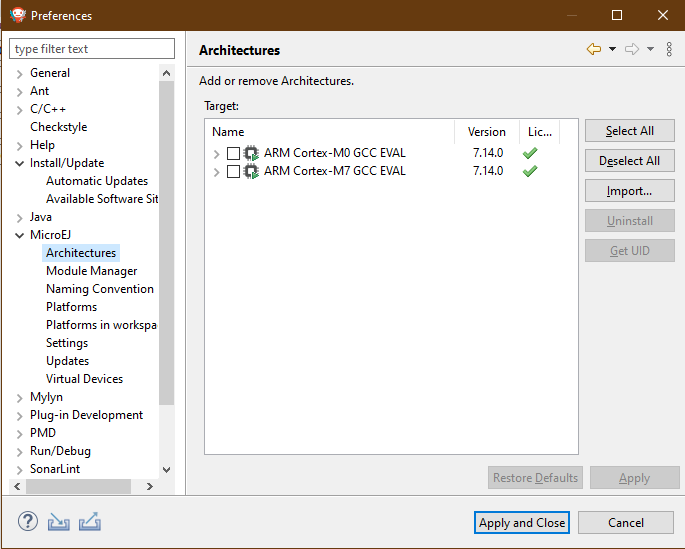
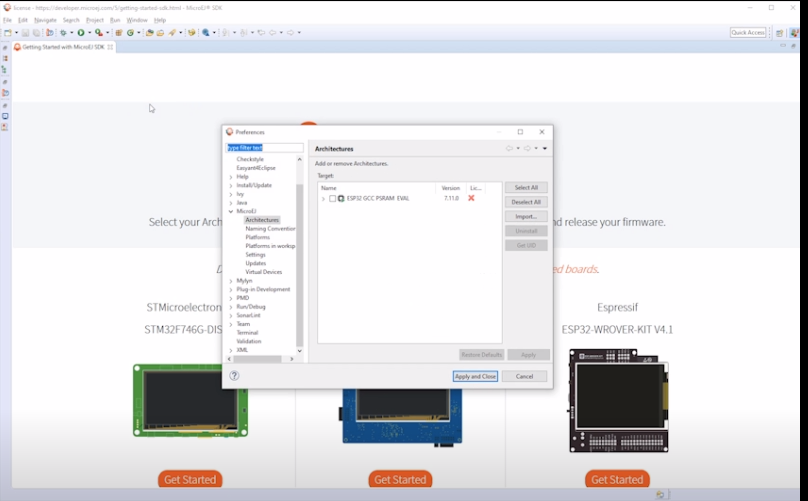

Start your first MicroEJ GUI application in 15 Minutes
======================================================

Prerequisites
-------------

-  Supported Operating System: MICROEJ SDK runs on the following operating systems: Windows (7, 8, 8.1, 10), Linux, macOS.
-  
- A Java™ Runtime Environment 8 is needed on your host computer for
   running MICROEJ SDK. [Download Java™ Runtime Environments]

Download and Install
--------------------

#.  Download the installer package corresponding to your host computer OS `MicroEJ SDK <https://repository.microej.com/packages/SDK/21.03/MicroEJ-SDK-Installer-Win64-21.03.exe>`__

#.  Unzip the downloaded installer package, if needed and execute the installer.

Start the IDE for the first time
--------------------------------

#. Start MICROEJ SDK and select a workspace. 

   .. note::

      ℹ️ If you are not familiar with Eclipse workspaces, select the default one and press OK.
   
#. Select the MicroEJ repository where to import MicroEJ architectures
   from. 

   .. note::

      ℹ️ If you are not familiar with MicroEJ repositories, select the default one and press OK.

Prepare platform sources
------------------------

#. Download and unzip the platform sources for 

   - `GCC <https://repository.microej.com/packages/referenceimplementations/M5QNX/1.2.0/STM32F7508-M5QNX-fullPackaging-eval-1.2.0.zip>`__
   - `IAR <https://repository.microej.com/packages/referenceimplementations/KUVW3/1.2.0/STM32F7508-KUVW3-fullPackaging-eval-1.2.0.zip>`__

#. Select ``File > Import > MicroEJ > Architectures`` and click on Next> and
   choose the directory platformArchitecture inside the unarchived
   folder, Read the license of the targets, and then click **Finish**.

   |image0|

#. Select :guilabel:Window > :guilabel:Preferences > :guilabel:MicroEJ > :guilabel:Architectures and click on
   Import..., find the previously extracted folder and select the
   MicroEJ Architecture directory. 

   .. note::

      ℹ️ There will be an X on architecture, this will be adressed soon 
   
   |image1|

#. Select the :guilabel:File > :guilabel:Import > :guilabel:General > :guilabel:Existing Projects into
   Workspace and click on :guilabel:`Select archive file` and browse for the previously
   extracted folder to locate the **MicroEJ Platform Reference
   Implementation file(e.g. [board]-[uid]-platformSource.zip)** and
   import all available Eclipse projects,and then click **Finish**

   |image2|

Create your license
-------------------

#. Go to `license.microej.com <https://license.microej.com>`__ and create a new account.
#. After receiving the confirmation e-mail, login to your account and
   click on Activate a License.
#. Set Product P/N: to 9PEVNLDBU6IJ.
#. To get your UID from the MicroEJ SDK, select :guilabel:Window > :guilabel:Preferences > :guilabel:MicroEJ > Architectures menu, click on one of the available architectures and press Get UID. 
   
   |image3|

#. Wait for the e-mail confirmation and download the attached zip file
   that contains your activation key. 

   .. note::
   
      ℹ️ You should receive your activation key by email in less than 5 minutes. If not, please contact support@microej.com.

Activate your license
---------------------

#. Back to MicroEJ SDK, select the ``Window > Preferences > MicroEJ`` menu
   and press Add... to select the downloaded activation key archive
   file.
#. Go to Architectures sub-menu and check that all architectures are now
   activated (green check). 
   
   |image4|

Build Your Platform
-------------------

#. Inside the **{PLATFORM}-configuration** project, open the
   **.platform** File MicroEJ platform configuration file. From this
   MicroEJ platform configuration file, click on the link Build Platform
   
   |image5|

#. The message should print show build succesful 

Create a New Project
--------------------

#. First, Go to ``File > New > Standalone Project``

   |image6|

#. The Project Structure should look like this 

   |image7|

Featured project #.Demo Widget
------------------------------

#. instructions to download import and launch Demo Widget 

   |image8|

