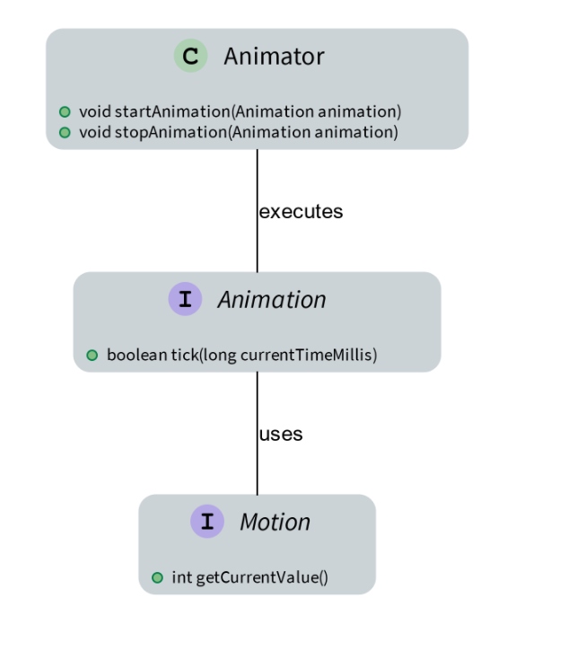
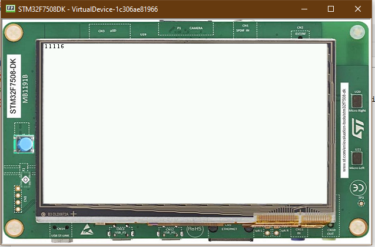

Animation
=========

-  To use animation, the Animation class is going to be used
-  The main goal with animation is to set the widget graphics in motion
   to make the GUI more appealing and more lively 
   |image0|

Usage
-----

-  Using Animation is easy, Just Override the method tick() in the
   Animator class
-  Everytime the method is called, the widget should be re-rendered, or
   Else, it's not going to show 
   
   .. code:: java 
   
    Animation lblAnimation = new Animation() { 
        @Override public boolean tick(longcurrentTimeMillis) { 
            label.setText(Integer.toString(tick++));
            label.requestRender();
            return true; 
        } 
    };
    Animator animator = new Animator();
    animator.startAnimation(lblAnimation); 

- The code above updates the label text everytime it's called

|image1| 

- The final code should look like this

.. code:: java

    public static void main(String[] args) {
        MicroUI.start();
        Desktop desktop = new Desktop();
        Label label = new Label("hello");

        Flow flow = new Flow(LayoutOrientation.VERTICAL);
        flow.addChild(label);

        Animation lblAnimation = new Animation() {
            @Override
            public boolean tick(long currentTimeMillis) {
                label.setText(Integer.toString(tick++));
                label.requestRender();
                return true;
            }
        };
        Animator animator = new Animator();
        animator.startAnimation(lblAnimation);
        desktop.setWidget(flow);
        desktop.requestShow();
    }

