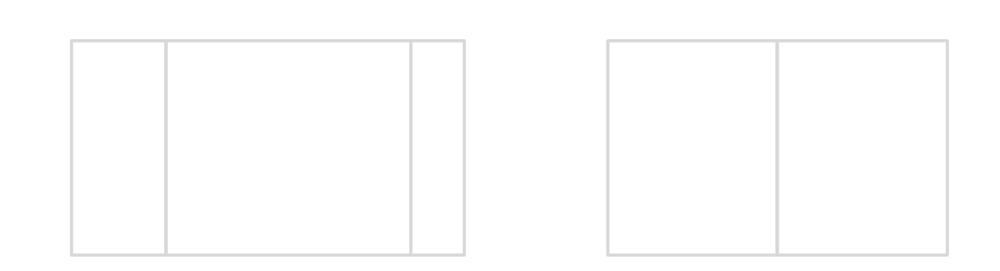

Layout
======

-  The lay out process determines the position and size of the widgets.
-  It depends on:

   -  the layout of the containers: how are arranged the children within
      the containers.
   -  the widgets content size: the size needed by the widgets for
      optimal display.
   -  This process is started automatically when the Desktop is shown.
      It can also be triggered programmatically. ## Flow Layout

-  Flow layout: lays out any number of children horizontally or
   vertically, using multiple rows if necessary deppending on the size
   of each added widget |image0|
-  Creating a Flow Layout
-  Instead of adding directly to the desktop, first, you Create a flow
   container, and then add everything to this flow container, and then,
   add to the Desktop

   .. code:: java

       public static void main(String[] args) {
           MicroUI.start();
           Desktop desktop = new Desktop();
           Label label = new Label("Hello World");
           Label label2 = new Label("Hello World 2");

       Flow flowContainer = new Flow(LayoutOrientation.HORIZONTAL);
       flowContainer.addChild(label);
       flowContainer.addChild(label2);

       desktop.setWidget(flowContainer);
       desktop.requestShow();
       }

-  Both of the labels will share half of the screen > |image1| ## Canvas
   Lays out any number of children freely
-  To use canvas, just add the widget, and it's position on the screen,
   it's width and length > ℹ️ in this case, using Widget.NO\_CONSTRAINT
   sets the width and height to the standard size of the widget

.. code:: java

    public static void main(String[] args) {
        MicroUI.start();
        Desktop desktop = new Desktop();
        Label label = new Label("Hello World");
        Label label2 = new Label("Hello World 2");

        Canvas canvas = new Canvas();
        canvas.addChild(label, 0, 0, Widget.NO_CONSTRAINT, Widget.NO_CONSTRAINT);
        canvas.addChild(label2, 0, 15, Widget.NO_CONSTRAINT, Widget.NO_CONSTRAINT);

        desktop.setWidget(canvas);
        desktop.requestShow();
    }

    |image2| ### Previous ### Next

