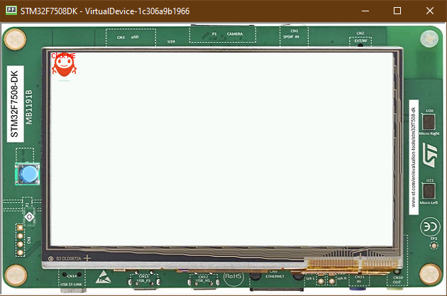

Advanced Styling
================

Imaging with stylesheets
------------------------

-  It's possible to set images as styles, using on a button for example
-  Since we are going to set the image as background on only one button,
   We need to use a class select, which it's an Integer that relates to
   the Button ### Class Selector
-  Just like a class on CSS, it associates to every element that are
   from the same class
-  Creating a class for button for example

   .. code:: java

       private static final int BUTTON = 600;

-  Then, after creating the button, we can associate this 'Class' to it

   .. code:: java

       Button button = new Button("Click ME");
       button.addClassSelector(BUTTON);

-  Then, we can edit the style associated with this class

   .. code:: java

       EditableStyle style = css.getSelectorStyle(new ClassSelector(BUTTON));;

-  Finally, lets add an Image Background to this Button

   .. code:: java

       style.setBackground(new ImageBackground(Image.getImage("/images/mj.png")));

   And the result should be this one

   .. code:: java

       public class Main {
           private static final int BUTTON = 600;

       public static void main(String[] args) {
           MicroUI.start();
           Desktop desktop = new Desktop();
           Button button = new Button("Click ME");
           button.addClassSelector(BUTTON);

           Flow flow = new Flow(LayoutOrientation.VERTICAL);
           flow.addChild(button);

           CascadingStylesheet css = new CascadingStylesheet();
           EditableStyle style = css.getSelectorStyle(new ClassSelector(BUTTON));
           style.setBackground(new ImageBackground(Image.getImage("/images/mj.png")));

           desktop.setStylesheet(css);
           desktop.setWidget(flow);
           desktop.requestShow();
       }
       }

   .. figure:: images/imagebackgroundexample.png
      :alt: 

Combinator and Conditional style
~~~~~~~~~~~~~~~~~~~~~~~~~~~~~~~~

-  It's possible to combine two or more Classes using a combinator
-  In this example the active state of the Button will turn the text red
   \`\`\` Main.java CascadingStylesheet css = new CascadingStylesheet();
   Selector imageButton = new ClassSelector(BUTTON); EditableStyle style
   = css.getSelectorStyle(imageButton); style.setBackground(new
   ImageBackground(Image.getImage("/images/mj.png")));

Selector activeSelector = new StateSelector(Button.ACTIVE);
EditableStyle styleActive = css.getSelectorStyle(new
AndCombinator(imageButton, activeSelector));
styleActive.setColor(Colors.RED); \`\`\` > instead of directly
insantiating classSelector in the get selector style, The ClassSelector
has been exposed to be combined with the ButtonActive selector

Previous
~~~~~~~~

Next
~~~~

