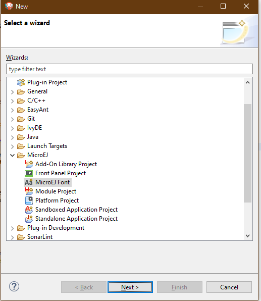
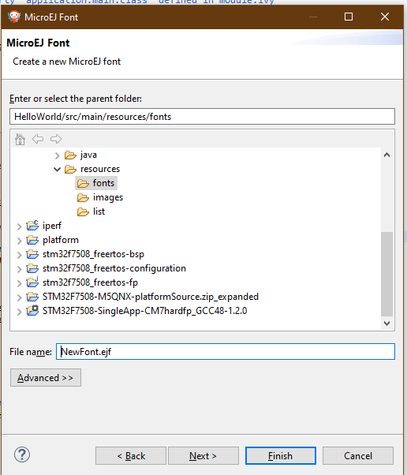
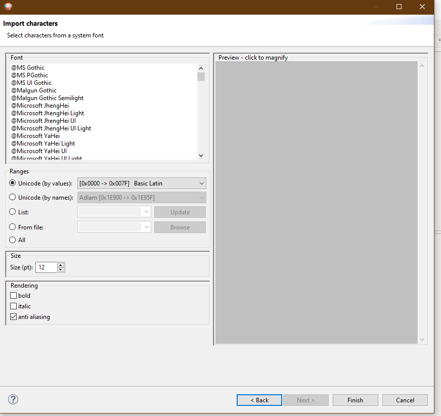
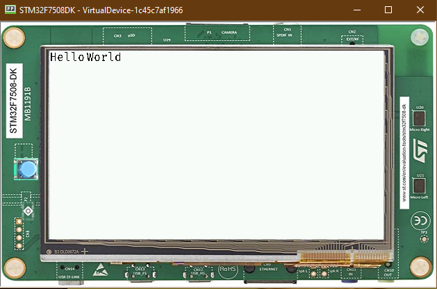

Fonts
=====

-  Fonts are graphical resources that can be accessed with a call to
   ej.microui.display.Font.getFont(). To be displayed, these fonts have
   to be converted at build-time from their source format to the display
   raw format by the font generator tool.
-  Fonts, just like images, must be declared at the \*.fonts.list #
   Creating a font
-  To create a font, go to the package you want to store your fonts,
   Normally **Resources-> fonts**
-  Then **Left-Click->new->Other->MicroEJ->MicroEJ Font**

-  Then,Select the name of the font

|image0| \* After that, this window should open

|image1| > It's important to have the font that you want already
installed at the system \* If you are using a latin based alphabet, just
left the settings as they are and click finish

|image2| \* Click finish, and the font should be imported in the .ejf
file

-  Then just add the font to the \*.font.list file

   .. code::

           /fonts/NewFont.ejf

Adding the font to a Label
==========================

-  To add the font, you simple change the font on a StyleSheet

.. code:: java

            Label l = new Label("Hello World");
            l.addClassSelector(BUTTON);
            Font font = Font.getFont("/fonts/NewFont.ejf");
            CascadingStylesheet css = new CascadingStylesheet();
            EditableStyle style = css.getSelectorStyle(new ClassSelector(BUTTON));
            style.setFont(font);

    Don't forget to add the Style to the Desktop

|image3| > The font used was FiraCode

.. |image1| image:: images/fonteditor.png

