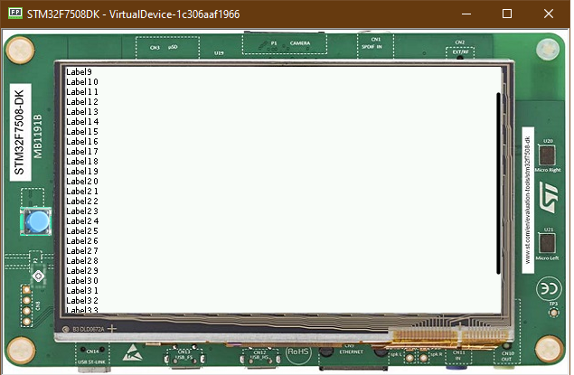
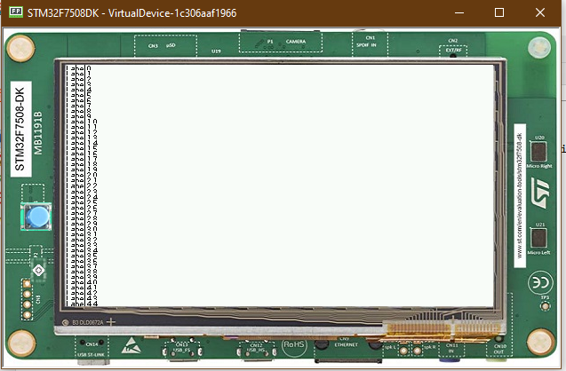

Scroll List
===========

List
----

-  A list is a Container that resizes each of its child accordingly
-  Naturally, It shows some issues if you add too many components
-  Using as an example the code used before, with the new font, adding
   20 components shows the following result |image0|
-  Using MicroEJ, it's possible to create a Scrollable List to avoid
   this issue

.. code:: java

            List list = new List(LayoutOrientation.VERTICAL);
            for (int i = 0; i < 45; i++) {
                Label lbl = new Label("Label" + i);
                lbl.addClassSelector(BUTTON);
                list.addChild(lbl);
            }

Scrollable List
---------------

-  It's possible to create our own components, so, for example, it's
   possible to use a Scrollable Container
-  The full implementation of the class is available at `Widget
   Demo <>`__
-  The usage is pretty simple \`\`\`Main.java MicroUI.start(); Desktop
   desktop = new Desktop(); Label label = new Label("Hello World");
   Label label2 = new Label("Hello World 2"); ScrollableList list = new
   ScrollableList(LayoutOrientation.VERTICAL); for (int i = 0; i < 45;
   i++) { Label lbl = new Label("Label" + i);
   lbl.addClassSelector(BUTTON); list.addChild(lbl); }
   CascadingStylesheet css = new CascadingStylesheet(); Scroll scroll =
   new Scroll(LayoutOrientation.VERTICAL, animator);
   scroll.setChild(list); desktop.setStylesheet(css);
   desktop.setWidget(scroll); desktop.requestShow();

\`\`\` \* Using the scroll container(Called Scroll), then adding the
ScrollableList as a Child \* It should look like this

